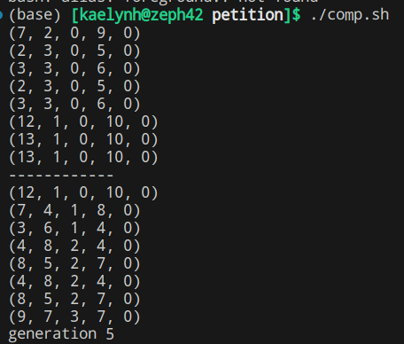

# Minimal NSGA-III in x86

As a semester project, I've written a minimal form of NSGA-III in x86 assembly. It has 12 built-in reference directions it uses for design point spacing, generated with the [Pymoo library](https://pymoo.org/). The number of generations and mutation rate are set with values in the `.data` section of the program. 8 design points are currently also hard-coded with values in the `.data` section of the program; their 5-integer tuples preserve their x values, y values, future Pareto rank, closest reference direction affiliation, and a flag variable. Adding to this `listxy` variable will require proper adjustment of the `count` variable to prevent indexing issues.

To run this program, clone the repository and open a terminal to the project's directory. Run the following command:
`nasm -f elf32 nsgaiii.s -o nsgaiii.o && gcc -nostartfiles -no-pie -m32 -o nsgaiii nsgaiii.o && ./nsgaiii` (or `./comp.sh`).

## Details

Some mathematical trickery was used to emulate 6 bits of precision for the reference direction affiliation calculations, but no such floating-point emulation appears anywhere else in the program. Binary tournaments are used to select parent design points from the current generation. Single-point crossover is applied to the lowest byte (given that small intger values were being tested) and the mutation bitmask also applies to just the lowest byte of X or Y value numbers (even through the numbers are encoded as double-dwords for programmatic ease). This occurs until the child generation matches the parent generation in size, at which point Pareto rankings are reevaluated, reference directions are assigned, and the composite list of parent and child design points is sorted via bubble sort to ensure only the best values make it to the next generation. This repeats for the number of generations specified in the `.data` section of the program.

## Limitations & Extensibility

Because this was merely a semester project, there are several shortcomings that could not be addressed within the timeframe of development. However, some of these drawbacks would be straightforward to fix, while others are inherent drawbacks of programming in assembly.

- Floating point values are not handled at this time due to no FPU instructions
- Only 2-objective problems are handled with how data is modeled currently (X and Y)
- Direct crossover as employed here is not probablistically favored in most modern genetic algorithms; simulated binary crossover is tradionally used to preserve gaussian distributions of crossed-over values, but was prohibitively complex for this scenario
- Little attention was paid to runtime complexity of the loops involved, but several different schemes for Pareto front ranking have been published that may offer gains in efficiency
